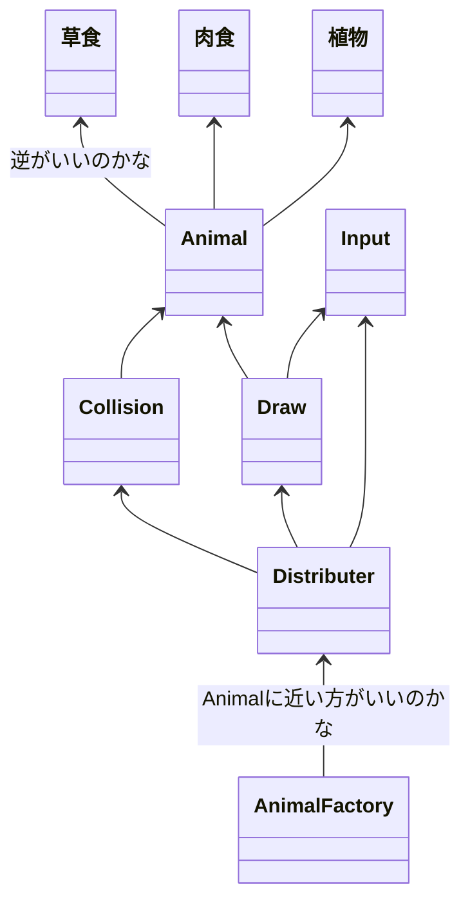

```mermaid
classDiagram
    草食 <-- Animal :逆がいいのかな
    肉食 <-- Animal
    植物 <-- Animal
    Animal <-- Collision
    Animal <-- Draw
    Collision <-- Distributer
    Draw <-- Distributer

    Input <-- Draw
    Input <-- Distributer

    Distributer <-- AnimalFactory : Animalに近い方がいいのかな
    

```